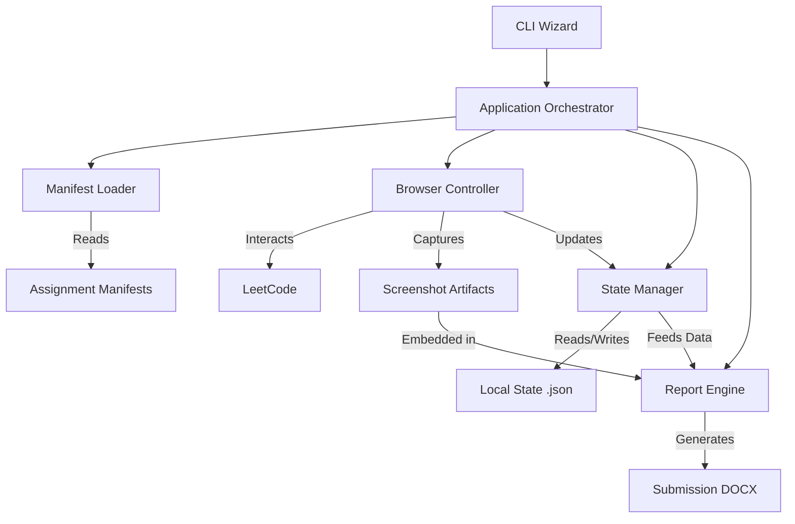

# System Design Document (SDD)
## Career Essentials LeetCode Assignment Automation

### 1. Document Control
- **Author:** Antigravity Agent
- **Date:** 2026-09-27
- **Version:** 6.0 (Debugging Phase & Explanations Update)
- **Status:** PENDING REVIEW

### 2. Overview
**Problem:** Students manually perform highly repetitive navigation, code insertion, execution, and documentation for 150 LeetCode problems, which is error-prone and time-consuming.
**Current Situation:** Manual workflows involve executing problems and copy-pasting screenshots into Word, leading to formatting penalties and wasted time.
**Proposed System:** A local, CLI-driven automation system that parses assignments, interactively authenticates the user, navigates problems linearly, executes known-good solutions, and programmatically captures and compiles evidence.
**Primary Inputs:** Predefined assignment text manifests (`ALL ASSIGNMENTS.txt`), user-provided identity metadata, and validated solutions.
**Major Processing Flow:**
CLI Initialization -> Local Browser Login -> Smoke Test (Preflight) -> Manifest Iteration -> Browser Automation (Inject, Wait, Submit, Capture) -> State Persistence -> DOCX Generation.
**Major Outputs:** Local state persistence files (`.local/state/`), calibrated screenshots (`.local/screenshots/`), and final Moodle-ready reports (`[PRN].docx`).
**Architectural Philosophy:** Local-first, modular, deterministic, phase-gated, and heavily reliant on persistent state recovery to handle browser/network instability.
**Technical Feasibility:** Extremely high. Playwright handles SPA DOM navigation; `python-docx` handles the Microsoft Word rubric requirements; atomic JSON writes handle state recovery.
**Major Technologies:** Python, Playwright, python-docx, Pydantic, JSON Schema.
**Operating Environment:** Local desktop environment with network access to LeetCode.
**Prototype / Current Scope:** Automation of Assignments 1-3 and generation of Assignment 4 framework.
**Major Constraints:** Must use a 60-second delay between insertion and submission to simulate human cadence; must use exact DOM states for validation.
**Key Risks:** LeetCode DOM changes breaking locators; authentication session invalidation.
**High-Level Validation Approach:** Mandatory Smoke Test before any batch execution; programmatic validation of generated DOCX structures against manifest expectations.

### 3. Problem
The underlying problem is the massive administrative overhead of documenting 150 LeetCode problems. The current manual workflow involves solving/pasting, taking a screenshot, cropping it manually to ensure username and status are visible, formatting a Word document table, and pasting the image. Deficiencies include missed screenshots, accidental cropping of required metadata, and immense time waste. The consequence is academic penalties for formatting and loss of productive learning time.

### 4. Current Situation
Students currently perform all steps manually. The need for the system arises because the cognitive load of documenting the solution vastly exceeds the cognitive load of the algorithmic problem itself for this specific assignment rubric.

### 5. Proposed System
The proposed system is an autonomous documentation engine. It acts as a specialized headless (or headed) browser agent that takes over the mechanical execution and evidence-gathering phase once the student provides the solutions. It strictly enforces the assignment sequence and guarantees rubric-compliant output formatting.

### 6. Objectives
- Ensure 100% compliance with the provided Moodle assignment rubrics (table structure, metadata).
- Reduce documentation time for 150 problems to zero manual hours post-login.
- Guarantee crash-recoverability without duplicate submission attempts on LeetCode.
- Generate valid, parseable DOCX artifacts.

### 7. Scope
**Current / Prototype Scope:**
- Ingestion of `ALL ASSIGNMENTS.txt`.
- Playwright-based browser execution and submission.
- Deterministic screenshot capture and calibration.
- Local state persistence (`.local/`).
- Report generation for Assignments 1-3.
- Separate Mock Test (Assignment 4) report generation workflow.
**Production Considerations:** Ensure zero credentials are hardcoded or leaked into logs.
**Out of Scope:** Spaced repetition, adaptive tutoring, WhatsApp notifications, algorithmic solution generation.

### 8. Requirements
**Functional Requirements:**
- **FR-01 (Initialization):** System must prompt for Name, PRN, Division, Batch, and LeetCode Username.
- **FR-02 (Authentication):** System must launch a local browser for interactive login.
- **FR-03 (Account Verification):** System must verify the logged-in username matches the provided username.
- **FR-04 (Manifest):** System must parse `ALL ASSIGNMENTS.txt` into structured JSON.
- **FR-05 (Execution):** System must navigate, inject solution, wait 60 seconds, and submit.
- **FR-06 (Detection):** System must read DOM for 'Accepted' status.
- **FR-07 (Capture):** System must take a calibrated screenshot.
- **FR-08 (Persistence):** System must save granular problem state locally.
- **FR-09 (Reporting):** System must generate `[PRN].docx` with exact rubric tables.
- **FR-10 (Debugging):** System must feedback execution errors to the Agent for automated correction and update manifests on success.

**Non-Functional Requirements:**
- **NFR-01 (Security):** Zero password storage.
- **NFR-02 (Reliability):** Must resume exactly from the last `VERIFIED` completed problem.
- **NFR-03 (Determinism):** Screenshot cropping must be deterministic after initial calibration.
- **NFR-04 (Modularity):** Browser code must not be coupled to report generation code.

### 9. Assumptions / Operating Conditions
- **Workload:** 150 total core problems.
- **Concurrency:** Single-threaded, linear execution.
- **User Environment:** Python 3.10+, Playwright installed.
- **External Dependencies:** LeetCode platform availability.
- **Storage:** Local disk for artifacts (expected < 100MB total).

### 10. Technical Feasibility
- **Browser Automation:** Feasible via Playwright. Playwright's `BrowserContext` allows persisting cookies/localStorage across runs, enabling persistent sessions.
- **Local Authentication:** Feasible by launching a headed browser and waiting for the user to solve Captchas/login, then saving the state.
- **Document Generation:** Feasible via `python-docx`, which supports arbitrary table generation and image streaming.
- **State Persistence:** Feasible via atomic JSON file overwrites.

### 11. Architectural Philosophy
- **Local-First:** Keeps all state and execution on the user's machine to avoid credential transmission and server costs.
- **Explicit Contracts:** Components communicate via defined schemas (Pydantic) rather than loose dicts.
- **Stateful Recovery:** Expects failures (network, DOM changes) and relies on atomic state files to recover seamlessly.
- **Phase-Gated Implementation:** No production run occurs until a smoke-test proves the pipeline.

### 12. Architectural Alternatives and Decisions
- **Alternative:** Selenium vs. Playwright.
  - **Decision:** Playwright.
  - **Reasoning:** Playwright natively supports auto-waiting on elements, making it vastly superior for SPAs like LeetCode.
- **Alternative:** SQLite vs. JSON files for state.
  - **Decision:** JSON files.
  - **Reasoning:** 150 records is trivial. JSON allows easy manual inspection and modification if debugging is needed.
- **Alternative:** Fully Automated Login vs. Interactive.
  - **Decision:** Interactive.
  - **Reasoning:** Fully automated login against LeetCode is brittle due to Cloudflare and Captchas. Interactive is robust and secure.

### 13. High-Level Architecture

### 14. Architectural Layers
- **Presentation Layer (CLI):** Prompts inputs, displays progress.
- **Orchestration Layer:** Coordinates phases, manifest iteration, error policies.
- **Execution Layer (Browser):** DOM interactions, waiting, submission, screenshotting.
- **Data Layer (State & Reports):** Persists JSON state, generates DOCX files.

### 15. Components

**15.1 Browser Controller**
- **Purpose:** Automates interactions with LeetCode.
- **Architectural Responsibility:** Isolate all Playwright/DOM logic from the rest of the app.
- **Internal Mechanism:** Uses Playwright `BrowserContext`, `Page`, and `Locator` with explicit waits.
- **Human Explanation:** The robot that clicks buttons, types code, and reads the screen on LeetCode.
- **Inputs:** Target URL, Solution text.
- **Outputs:** `SubmissionResult` object.
- **State Owned:** None (stateless execution).
- **Failure Modes:** Timeout, ElementNotFound.
- **Validation:** Returns strongly-typed result.

**15.2 State Manager**
- **Purpose:** Persist execution state.
- **Architectural Responsibility:** Ensure atomic reads/writes to avoid corruption.
- **Internal Mechanism:** JSON serialization with temporary file swaps (`os.replace`).
- **Human Explanation:** The "save game" system that remembers which problems are done.
- **Inputs:** `ProblemExecutionState` updates.
- **Outputs:** Current overall state dictionary.
- **Failure Modes:** File permission errors.

**15.3 Manifest Loader**
- **Purpose:** Parse canonical documents.
- **Architectural Responsibility:** Provide structured data to the orchestrator.
- **Internal Mechanism:** Regex and JSON Schema validation.
- **Human Explanation:** Translates the professor's text file into a computer-readable list.

**15.4 Report Engine**
- **Purpose:** Generate DOCX.
- **Architectural Responsibility:** Apply formatting rules exactly as specified.
- **Internal Mechanism:** `python-docx` table APIs.
- **Human Explanation:** The document builder.

### 16. Data Architecture
- **StudentIdentity:** `name`, `prn`, `division`, `batch`, `leetcode_username`, `profile_url`. (Source: CLI).
- **ProblemDefinition:** `assignment_id`, `sequence_number`, `leetcode_id`, `title`, `difficulty`, `language`, `solution_code`, `explanation`. (Source: Manifest / External fetch).
- **ProblemExecutionState:** `problem_id`, `state` (Enum), `screenshot_path`, `submission_date`. (Source: State Manager).
- **ReportMetadata:** Aggregation of the above for `python-docx`.

### 17. Interfaces and Contracts
- **AssignmentManifest Schema:** Must be a valid JSON array of `ProblemDefinition` objects, ensuring the solution source is embedded.
- **SubmissionResult Contract:** Must contain `success: bool`, `failure_reason: str | None`, `screenshot_path: str | None`.

### 18. State and Workflow Architecture
Transitions for a Problem:
- `PENDING` -> User initiates run -> `LOADING`
- `LOADING` -> Browser navigates to URL -> `OPEN`
- `OPEN` -> Solution injected -> `SOLUTION_READY`
- `SOLUTION_READY` -> 60s wait -> `WAITING_TO_SUBMIT`
- `WAITING_TO_SUBMIT` -> Submit clicked -> `SUBMITTING`
- `SUBMITTING` -> DOM indicates Accepted -> `ACCEPTED`
- `SUBMITTING` -> DOM indicates Error -> `FAILED`
- `FAILED` -> Agent Debugging Phase -> `OPEN` (Loop)
- `ACCEPTED` -> Screenshot taken -> `VERIFIED`
- `VERIFIED` -> State saved to disk -> `COMPLETED`

### 19. Error Handling / Failure Semantics
- **Infrastructure Failure (Timeout):** Caught by Playwright. Problem remains `PENDING`/`OPEN`. Safe to retry.
- **Solution Failure (Wrong Answer/Runtime Error):** Detected in DOM. Enters Debugging Phase where agent is invoked to provide a corrected solution.
- **State Persistence Failure:** Fails loudly before moving to the next problem to prevent out-of-sync execution.

### 20. Security
- Playwright profile saved to `.local/browser-profile`.
- `.gitignore` ignores `.local/`.
- No logging of passwords or session tokens.

### 21. Reliability and Recovery
- Resumes by filtering out any problems where `state == COMPLETED`.
- Atomic writes ensure `state.json` is never half-written during a crash.

### 22. Observability
- File: `.local/logs/execution.log`.
- Format: `[TIMESTAMP] [INFO] [Assignment 1] [Problem 1] - Status: COMPLETED`.

### 23. Evaluation and System Validation
- **Authentication:** `detected_username == StudentIdentity.leetcode_username`
- **Manifest Completeness:** Length of parsed array matches known constant (50).
- **Report Validity:** `image_count == expected_problem_count`.

### 24. Testing Architecture
- **Smoke Tests:** Mandatory E2E on Problem 2235 (Add Two Integers).
- **Unit Tests:** Manifest parser tests against expected JSON.
- **Integration Tests:** State manager atomic write tests.

---

### 25. Development Architecture (Phase Architecture)

## Phase 1: SDD & Planning

**FR/NFR Mapping:**
*   NFR-04 (Modularity)
*   NFR-03 (Determinism)

**Overview & Objective:**
*   **Foundation:** Establish the architectural blueprint and define the canonical contracts across all modules before writing execution code.
*   **The Risk Addressed:** Feature creep, architectural drift, and non-deterministic behavior that would invalidate academic submissions.

**Workflow & Mechanisms (Algorithms):**
*   **Context Ingestion:** Ingest repository contexts, assignments, and rubrics recursively to build an accurate mental model of the requirements.
*   **Structural Planning:** Define the finite state machine (`PENDING` -> `COMPLETED`) mapping out exact application states.
*   **Architectural Standard Enforcement:** Execute documentation workflows to output a highly detailed, rigid standard for all subsequent implementation phases.

**Expectations & Output:**
*   **Output Directories:** `SDD.md` populated in root directory.
*   **Standardized Annotations:** Documented Component X Phase matrices and architectural dependency graphs.
*   **Validation:** Require explicit user verification of the SDD blueprint before entering Phase 2.

---

## Phase 2: Manifest & Data Structures

**FR/NFR Mapping:**
*   FR-04 (Manifest Loading)

**Overview & Objective:**
*   **Foundation:** Establish the canonical data foundation by parsing assignment mandates, generating ready-to-execute payloads, and producing rich educational explanations.
*   **The Leakage Risk:** Running execution code without verified solutions will fail in the browser. The data phase MUST aggregate not just the problem ID, but the actual algorithmic solution code and its logical explanation itself prior to execution.

**Workflow & Mechanisms (Algorithms):**
*   **Input Pipeline:** Ingest unstructured raw text `ALL ASSIGNMENTS.txt` utilizing **regular expressions** (e.g., `re.match`) to dynamically map assignment boundaries and extract LeetCode ID integers and string titles.
*   **Metadata & Solutions Fetching (Solution Hydration Engine):** Implement a Python script (`src/solution_hydration.py`) that queries the internet to retrieve optimized Python/SQL code and **detailed explanations** for each LeetCode ID. If the script cannot find a solution/explanation, it delegates the problem directly to the Antigravity agent as a fallback.
*   **Educational Markdown Generation:** During the hydration process, write the detailed explanations and solutions to a `solutions.md` file, providing a complete educational repository of the logic for each problem.
*   **Automated Code Validation Pipeline:** Pass all hydrated solutions through an automated Python static analysis script (`src/solution_validator.py`). This performs `ast.parse` syntax checks and output validation without manual agent intervention to minimize tokens.
*   **Data Aggregation:** Aggregate the static text data with the dynamically fetched solutions into unified **ProblemDefinition** Pydantic objects.

**Expectations & Output:**
*   **Output Directories:** Produce strictly structured JSON manifests within a new `solutions_manifests/` directory. Create `solutions.md` in the root.
*   **Standardized Annotations:** Generate files strictly matching the `ProblemDefinition` JSON schema, ensuring the `solution_code` attribute is populated.
*   **Validation:** Execute a **programmatic assertion** proving that exactly 50 problems are found per assignment, and the validation pipeline confirms all Python codes compile syntactically.

---

## Phase 3: State & Configuration

**FR/NFR Mapping:**
*   FR-01 (CLI Input)
*   FR-08 (Persistence)
*   NFR-02 (Reliability/Recoverability)

**Overview & Objective:**
*   **State Integrity:** Ensure the application never duplicates work or corrupts its history upon unexpected termination (e.g., laptop power loss).

**Workflow & Mechanisms (Algorithms):**
*   **CLI Orchestration:** Construct an interactive wizard via `argparse`/`rich` to securely input user metadata (PRN, Name) without hardcoding into the repository.
*   **State Machine Initialization:** Translate the static JSON manifests into a dynamic state dictionary mapping each problem to `PENDING`.
*   **Atomic Persistence Logic:** Mitigate file corruption by applying an **atomic swap algorithm** (writing to a `.tmp` file and executing `os.replace` over the original) during every FSM transition.

**Expectations & Output:**
*   **Output Directories:** Generate `.local/config.json` and `.local/state.json`.
*   **Standardized Annotations:** Valid JSON bodies mapping identical schema formats.
*   **Validation:** Validate atomic consistency by killing the process mid-write and verifying fallback integrity.

---

## Phase 4: Browser Auth Foundation

**FR/NFR Mapping:**
*   FR-02 (Interactive Auth)
*   FR-03 (Account Verification)
*   NFR-01 (Security)

**Overview & Objective:**
*   **Authentication Layer:** Establish a verified session with LeetCode without handling passwords programmatically, neutralizing bot-detection flags.

**Workflow & Mechanisms (Algorithms):**
*   **Persistent Context Engine:** Leverage Playwright's `launch_persistent_context` to initiate a browser instance that retains `localStorage` and `cookies` continuously on disk.
*   **Interactive Await:** Halt the automation thread dynamically, relinquishing control to the human user to solve Captchas and login manually.
*   **DOM State Detection:** Perform a **DOM Query Selector search** (e.g., waiting on `.user-profile-dropdown`) to mathematically verify the rendered DOM username exactly equals the user's expected `config.json` username.

**Expectations & Output:**
*   **Output Directories:** An active, populated `.local/browser-profile` folder containing session secrets.
*   **Standardized Annotations:** None.
*   **Validation:** Assert that the extracted DOM username strictly matches the configuration object, raising an immediate error on mismatch to prevent misattributed submissions.

---

## Phase 5: Smoke Test, Execution Core & Debugging Phase

**FR/NFR Mapping:**
*   FR-05 (Execution Loop)
*   FR-06 (Result Detection)
*   FR-07 (Screenshot)
*   FR-10 (Debugging)

**Overview & Objective:**
*   **The Execution Pipeline:** Prove the robotic pipeline can execute the complete state machine lifecycle on a single, isolated problem before a full batch run. Manage submission failures autonomously.

**Workflow & Mechanisms (Algorithms):**
*   **Navigation & Injection:** Issue Playwright commands to `goto` the LeetCode editor URL, wait for Monaco editor load events, and inject the `solution_code` via keyboard emulation (`page.keyboard.type`).
*   **Deterministic Bottleneck:** Enforce an exact 60-second asynchronous wait via `asyncio.sleep(60)` to artificially simulate human solving cadence.
*   **Detection Logic:** Click submit, wait for network idle, and execute a **string match verification** against the DOM to detect "Accepted" versus "Wrong Answer" / "Time Limit Exceeded".
*   **Debugging Phase (Agent Fallback):** If LeetCode returns an error (e.g., Wrong Answer, Runtime Error), the system intercepts the error text and invokes the Antigravity agent. The agent dynamically generates a corrected solution. This loop continues until the solution is "Accepted".
*   **Manifest Overwrite:** Once an agent-corrected solution is "Accepted", the system automatically overwrites the outdated solution in `solutions_manifests/` with the successful code to persist the correction.
*   **Calibrated Capture:** Execute a targeted `page.screenshot()` with specific `clip` bounding boxes to capture the required rubric artifacts.

**Expectations & Output:**
*   **Output Directories:** Output `smoke_test.png` and transition the local state to `COMPLETED`. Modified `solutions_manifests/` JSON upon debugging fixes.
*   **Standardized Annotations:** State Enum transition verification.
*   **Validation:** Smoke test must execute flawlessly end-to-end on Problem 2235, producing a valid image and a `COMPLETED` state footprint.

---

## Phase 6: Report Generation

**FR/NFR Mapping:**
*   FR-09 (Reporting)

**Overview & Objective:**
*   **Presentation Layer:** Automatically convert raw JSON state and PNG images into the precise Microsoft Word format demanded by the professor's rubric.

**Workflow & Mechanisms (Algorithms):**
*   **OpenXML Generation:** Leverage `python-docx` to instantiate an in-memory document tree.
*   **Data Binding:** Iterate linearly through the `state.json` file, binding `ProblemDefinition` text to dynamically generated Word Tables.
*   **Binary Embedding:** Stream the calibrated PNG artifacts from `.local/screenshots/` directly into the document's binary structure.

**Expectations & Output:**
*   **Output Directories:** Generate `[PRN]_assignment_[1-3].docx` in the root directory.
*   **Standardized Annotations:** Strict Word Document Table schema matching the Assignment rubric.
*   **Validation:** Ensure the length of generated tables mathematically equals the length of problems processed (e.g., 50 tables per document).

---

## Phase 7: Full Assignment Orchestration

**FR/NFR Mapping:**
*   FR-05 (Execution Loop)
*   NFR-02 (Reliability)

**Overview & Objective:**
*   **Batch Processing:** Scale the isolated Smoke Test mechanism up to a fully autonomous batch processor covering 150 problems.

**Workflow & Mechanisms (Algorithms):**
*   **Main Loop Processing:** Implement a deterministic `for` loop mapping over the manifested problems.
*   **State Pre-Check:** Execute a constant-time `O(1)` check against `state.json` to instantly skip any problem possessing a `COMPLETED` flag.
*   **Error Bubbling:** On a non-catastrophic failure (e.g., page load timeout), log the exception and dynamically increment a local retry counter. On consecutive failure, halt the entire sequence safely.

**Expectations & Output:**
*   **Output Directories:** Fully populated screenshot directories and completely marked `COMPLETED` states.
*   **Validation:** Verify that all 150 problems are iterated over seamlessly.

---

## Phase 8: Mock Test Workflow

**FR/NFR Mapping:**
*   FR-09 (Reporting)

**Overview & Objective:**
*   **Isolated Architecture:** Support Assignment 4 which breaks the standard algorithmic mold.

**Workflow & Mechanisms (Algorithms):**
*   **Manual Override:** Adjust the orchestrator loop to halt entirely for a manual Mock Test submission instead of attempting injection.
*   **Divergent Report Engine:** Branch the `python-docx` builder logic to only generate the mock test report template.

**Expectations & Output:**
*   **Output Directories:** `[PRN]_MockTest.docx`.
